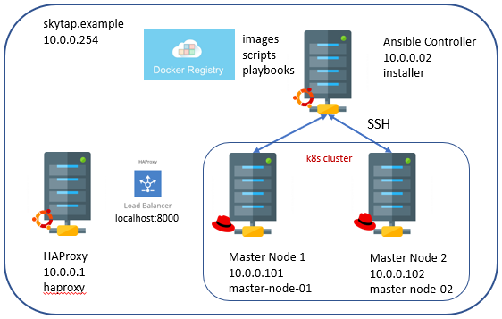

## <font color='red'>Infrastructure Pre-requisites</font>
The following pre-requiste steps have been completed and are listed just for Lab reference. 

This reference section covers:
  * Setup SkyTap Lab environment. 
     
  * Setup of Hitachi Vantara Foundry 2.3 Master / Worker Nodes.  
  * Setup of HAProxy 2.4

  * Generate SSH keys & deploy

#### Downloads
All files required for installation are available in the release folder and can be found in the link below:

<em>RHEL 8.4</em>

RedHat operates a subscription model.  You can download and install the OS for free, however, unless you purchase a subscription, you will not be able to update

* You will need to register as a [Developer with Red Hat](https://developers.redhat.com/?source=sso) 

* Once done, proceed over to the [Red Hat Login page](https://sso.redhat.com/auth/realms/redhat-external/protocol/openid-connect/auth?response_type=code&client_id=https%3A%2F%2Fwww.redhat.com%2Fwapps%2Fugc-oidc&redirect_uri=https%3A%2F%2Fwww.redhat.com%2Fwapps%2Fugc%2Fsso%2Flogin&state=0ddf0ac4-31c0-4895-997f-ec3f963b8468&login=true&scope=openid) to complete your profile by providing other details such as your address.

* Download the [RHEL 8.4 ISO](https://developers.redhat.com/products/rhel/download#assembly-field-downloads-page-content-61451?source=sso) file. 

``Login and register to activate the OS:``
```
# subscription-manager register
```
After registration, use the following command to attach any available subscriptions that match the current system.
```
# subscription-manager attach --auto
```
Note: Check that your subscriptions are activated in Red Hat.

<em>Hitachi Vantara Foundry 2.3</em>

<font color='green'>The required packages have been downloaded.</font>  

---

### <font color='red'>Skytap Lab</font>  

The SkyTap Lab environment is configured with: 

SkyTap DNS: 10.0.0.254 - This is automatically assigned.  
Domain Name: skytap.example  

| Server Name         | Host              |  IP address | OS              | User      | Password |
| --------------------| ------------------| ----------- | --------------- | ----------| ---------|
| HAProxy             | haproxy           | 10.0.0.1    | Unbuntu 20.04   | haproxy   | lumada   |  
| Master Node 1       | k8s-master-node-1 | 10.0.0.101  | RHEL 8.4        | k8s       | lumada   |
| Master Node 2       | k8s-master-node-2 | 10.0.0.102  | RHEL 8.4        | k8s       | lumada   |
| Ansible Controller  | installer         | 10.0.0.2    | Unbuntu 20.04   | installer | lumada   |
|

VM sequence: 
* Foundry Master 1-2 
* HAProxy 
* Ansible Controller 



---

### <font color='red'> Master / Worker Nodes</font>  

These servers were deployed with RHEL 8.4 Firstboot images.
Each of the nodes in the cluster has been configured with a 'k8s' user with sudo priviliges.

<font color='green'>The Master Nodes have been configured with the required user.</font>  

``update all nodes:``
```
sudo dnf check-update
sudo dnf clean all
sudo reboot
sudo dnf update
```

``check RHEL version:``
```
cat /etc/redhat-release
```

---

<em>add a 'k8s' user to the wheel group (log in as root):</em>  
The k8s account has previously been created. 

``add k8s to wheel group:``
```
sudo -i
usermod -aG wheel k8s
```
``check the assigned groups:``
```
groups
```
``or for the ids:``
```
id k8s
```
``check 'k8s' user on any master node:``
```
ls /home
```

---

<em> Enable SSH Connections</em>

``enable OpenSSH server to communicate through the firewall:``
```
sudo firewall-cmd --permanent --add-service ssh
sudo firewall-cmd --reload
sudo systemctl enable --now sshd
sudo systemctl reload sshd
```

---

<em>install nano:</em>  
Nano is a text editor.

``install editor (nano or vim):``
```
sudo dnf install -y nano
```

---

<em>allow users in group wheel to run all commands without password:</em>  

``edit sudoers:``
```
sudo nano /etc/sudoers  
```
```
## Allows users in group wheel to run all commands
%wheel  ALL=(ALL)     ALL

## Without password
%wheel  ALL=(ALL)     NOPASSWD:  ALL
```
``save:``
```
Ctrl +o
enter
Ctrl + x
```

---

### <font color='red'>Ansible Controller</font>  

This server has been configured with an 'installer' user with sudo privileges. 

<font color='green'>The Ansible Controller has been installed and configured.</font>  

``update (log in as root):``
```
sudo -i
apt update -y
apt upgrade -y
```
``add an 'installer' user:``
```
adduser installer
```
Note: password is 'lumada'  

``add 'installer' to sudo group:``
```
sudo usermod -aG sudo installer
```
``check the assigned groups:``
```
groups
```
``or for the ids:``
```
id installer
```
``check 'installer' user:``
```
ls /home
```

---

<em>allow users in group sudo to run all commands without password:</em>  

``edit sudoers:``
```
sudo nano /etc/sudoers
```
```
## Allows users in group admin to gain root privileges
%admin  ALL=(ALL)    ALL
%sudo   ALL=(ALL)    ALL  

## Without password
%sudo  ALL=(ALL)     NOPASSWD:  ALL
```
``save:``
```
Ctrl +o
enter
Ctrl + x
```
``reboot and check user:``
```
sudo reboot
sudo -v
```

---

### <font color='red'>Other Required Packages on Ansible Controller</font>  

Enusre that the following packages are also installed and configured:
* openssh server
* pip & pip3
* git
* visual studio code - just for training purposes
* tree - visualize directories

<font color='green'>The packages have been installed and configured.</font>  

---

<em>install openssh server:</em>  
``ssh client should already be installed:``
```
ssh -V
```
Note: you are currently only able to connect as a client to SSH servers
```
sudo apt install openssh-server 
```
``verify service is running:``
```
sudo systemctl status sshd
```
Note: By default, your SSH server is listening on port 22.  
`if you need further details:`
```
sudo apt-get install net-tools
netstat -tulpn | grep 22^
```
If you are using UFW as a default firewall on your Ubuntu 18.04 host, it is likely that you need to allow SSH connections on your host:
```
sudo ufw status
```
Note: For training purposes it is inactive.  
``to enable SSH connections on your host:``
```
sudo ufw allow ssh
```

---

<em>install pip3 & pip:</em>

``ensure python is installed:``
```
sudo apt install python3-pip
```
``verify pip3 installation:``
```
pip3 --version
```
``enable the universe repository for pip:``
```
sudo add-apt-repository universe
```
``install python2:``
```
sudo apt update
sudo apt install python2
```
``use curl to download the get-pip.py script:``
```
sudo apt install curl
curl https://bootstrap.pypa.io/pip/2.7/get-pip.py --output get-pip.py
```
``install pip for Python 2:``
```
sudo python2 get-pip.py
```
``verify pip2 installation:``
```
pip2 --version
```

---

<em>install git:</em>    
used to access the LDOS-Workshop Git repository.  

``install Git:``
```
sudo apt install git
```
``verify the installation:``
```
git --version
```

---

<em>install Visual Studio Code:</em> 

``Visual Studio Code is used for workshop Lab Guide:``
```
sudo apt install snapd
sudo snap install --classic code
```
Note: Whenever a new version is released, Visual Studio Code package will be automatically updated in the background.
to use VSC:
```
cd
code
```

---

<em>install tree:</em> 

``to browse directories:``
```
sudo apt-get update -y
sudo apt-get install -y tree
reboot
```

---

#### <font color='red'>SSH Keys</font>  

Generate the required SSH keys to connect to LDOS nodes.  
You will need the IPs of the Cluster Nodes - refer to table above.

<font color='green'>The SSH keys have been generated and copied to all Nodes.</font>  

``generate ssh key:``
```
cd
ssh-keygen -t rsa
```
Note: keys are located in .ssh directory. 2 keys: id_rsa (private) id_rsa.pub (public)

``copy over key to k8s user on LDOS nodes:``
```
ssh-copy-id k8s@10.0.0.101
ssh-copy-id k8s@10.0.0.102
```
Password: lumada
Note: this will copy over both the private and public keys.


``test passwordless ssh connection:``
```
ssh -i ~/.ssh/id_rsa  k8s@10.0.0.101
exit
```

---

#### <font color='red'>Docker Registry Volume</font>  

Installation of the Foundry Platform and LDOS requires that the images are uploaded to a Regsitry to maintain versioning.   
In this workshop a locally, self-certified Docker Registry will be created on ``/installers`` volume. 

---

#### <font color='red'>HA-Proxy</font>  

This server has been configured with an 'haproxy' user with sudo privileges.  

<font color='green'>HAProxy server has been installed and configured.</font>  

``update (log in as root):``
```
apt update -y
```
``add an 'haproxy' user:``
```
adduser haproxy
```
Note: password is 'lumada'  

``add 'haproxy' to sudo group:``
```
sudo usermod -aG sudo haproxy
```
``check the assigned groups:``
```
groups
```
``or for the ids:``
```
id haproxy
```
``check 'haproxy' user:``
```
ls /home
```

---

<em>allow users in group sudo to run all commands without password:</em> 

``edit sudoers:``
```
sudo nano /etc/sudoers
## Allows users in group admin to gain root privileges
%admin  ALL=(ALL)    ALL
%sudo   ALL=(ALL)     ALL  

## Without password
%sudo  ALL=(ALL)     NOPASSWD:  ALL
```
``save:``
```
Ctrl +o
enter
Ctrl + x
```
``reboot and check user:``
```
sudo reboot
sudo -v
```

---

#### <font color='red'>HA Proxy</font>  

Install the latest HAProxy using a PPA.

  > browse to: https://haproxy.debian.net/

 Note: use the wizard to generate commands.

<font color='green'>HA Proxy server has been installed and configured.</font>

``enable PPA (log in as root):``
```
 apt-get install --no-install-recommends software-properties-common
 add-apt-repository ppa:vbernat/haproxy-2.5
```
``then install:``
```
apt-get install haproxy=2.5.\*
```
``verify installation:``
```
haproxy -v
```
``update and upgrade:``
```
sudo apt update && sudo apt upgrade -y
```

---

<em>Configure HAProxy</em>  
HAProxy is an open-source High availability proxy and load balancer that is popularly known for its efficiency and speed. Works for TCP and HTTP protocols, it is used to enhance the performance of a website by splitting up the load across multiple servers and to simplify the request processing tasks. 

Configure HAProxy to load-balance across the cluster.

the configuration file is located at:  
  /etc/haproxy/haproxy.cfg

Details can be found at:   
  > browse to: https://www.haproxy.com/documentation/hapee/latest/configuration/config-sections/defaults/


``rename the existing /etc/haproxy/haproxy.cfg to haproxy.cfg.bak:``
```
cd /etc/haproxy
sudo mv haproxy.cfg  haproxy.cfg.bak
```
``copy over 01-Infrastructure/01-Environment/haproxy.cfg to /etc/haproxy:``
```
cd /installers/Workshop-Foundry/

```
``restart haproxy:``
```
sudo systemctl restart haproxy
```
``test the installation:``

   > browse to:  http://localhost:8000/haproxy?stats

---